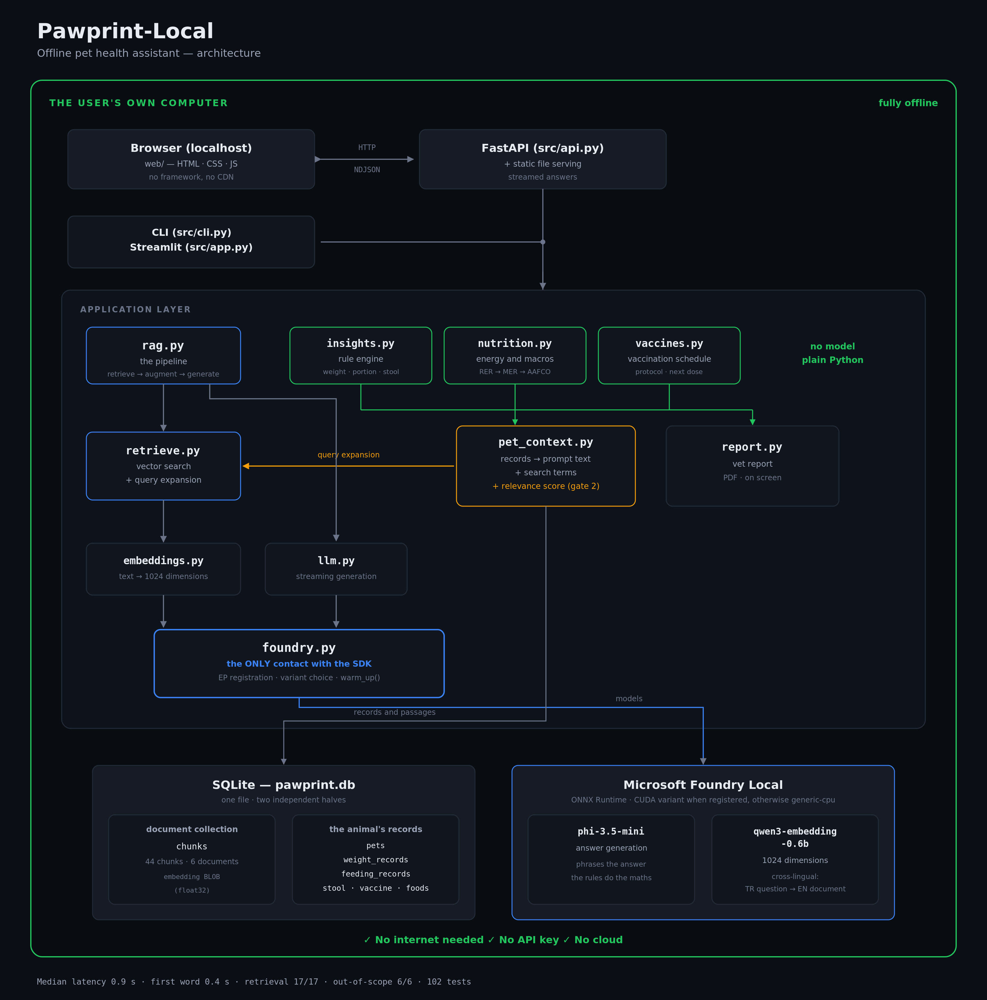
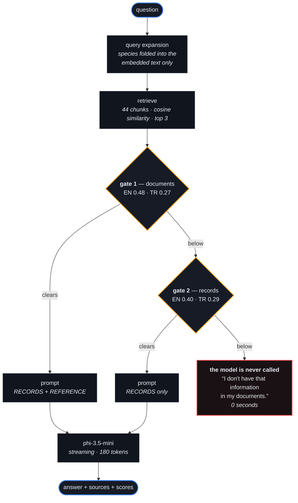

# Pawprint-Local

An offline pet health assistant. Keep your animal's records — weight, food,
stool, vaccinations — ask questions about them in plain language, and print a
report to take to the vet.

Everything runs on your own machine. No internet connection, no cloud account,
no API key, no telemetry. The language model runs locally through
[Microsoft Foundry Local](https://learn.microsoft.com/en-us/azure/foundry-local/what-is-foundry-local),
and the data never leaves the device.

```
you > My cat is straining in the litter box, is that urgent?

Yes — straining with little or no urine can indicate a urethral obstruction,
which is a medical emergency, especially in male cats. Contact an emergency
veterinary clinic right away.

Sources: emergency-signs.md
[1.3s]
This is not veterinary advice. See a vet for anything urgent.
```

<p align="center">
  
</p>

## Why

Ask a general-purpose model a specific question and it will often answer
confidently and wrongly. Before this project had a retrieval layer, we asked
`phi-3.5-mini` what RAG stands for:

> "RAG stands for Restart, Adapt, and Growth, a strategy often used by
> companies, particularly in the energy sector..."

Fluent, well formatted, entirely invented, with nothing in the answer to signal
it. Retrieval-augmented generation addresses this by pulling passages from a
trusted collection and requiring the model to answer from them, citing sources.
When nothing relevant is found, the assistant says so instead of guessing.

## What it does

**Health records.** Weight, feeding, stool and vaccinations, each on its own
page with its own history. Records are entered in grams, because that is what
labels use — a "cup" of two different foods differs by about 20% in weight.

**Nutrition analysis.** Daily energy requirement from the animal's weight,
species, age and neuter status, compared against what it is actually being fed.
Protein and fat are checked against the published AAFCO minimums for its life
stage. Daily, weekly and monthly views.

**Vaccination schedule.** What is due and when, from the same rules the document
collection states. A date written on the card by a vet overrides the general
rule. Overdue core vaccines appear as a reminder in the header.

**Questions.** Answered from the document collection and the animal's own
records together, so "should I reduce the portion?" gets a reply with real
numbers in it rather than a generality.

**Vet report.** Everything on one page, on screen and as a PDF. No sentence in
it is written by the language model — it is recorded data and rule-based
findings, which is also why it is available in full Turkish.

## Two kinds of knowledge

The distinction the whole design rests on:

```
  GENERAL                                   THIS ANIMAL
  data/docs/*.md                            SQLite records
  ────────────────                          ─────────────────
  "Adult dogs do well on                    "30.2 kg, target 28.0,
   two meals a day"                          420 g of Acme Premium,
  "Chocolate contains theobromine"           1596 kcal against 1363 needed"
        │                                          │
        │ chunked, embedded,                       │ passed through the
        │ retrieved by similarity                  │ rule engine
        ▼                                          ▼
  ┌──────────────────────────────────────────────────────┐
  │                    prompt, both labelled              │
  └──────────────────────────┬───────────────────────────┘
                             ▼
                 phi-3.5-mini, running locally
```

The model is never asked to do arithmetic. Energy requirements, portion
comparisons, weight trends and vaccination dates are all computed in plain
Python, so they are identical every time the page is opened. The model's job is
to phrase an answer, not to calculate one.

## Two gates before the model

A question only reaches the model if it clears one of two similarity checks.



Below both, the assistant declines without generating anything: correct, and
instant rather than a second and a half.

This is architectural rather than a prompt instruction, because prompt
instructions did not hold. Told as firmly as we could phrase it that it had no
general knowledge, the model still answered "who won the 1998 World Cup".
A model cannot be instructed out of knowing something. It can be not asked.

The two gates guard different things, and the thresholds sit above different
classes of question:

| | example | if it reaches the model |
|---|---|---|
| the model knows it | *"what is the capital of France"* | **it answers** — no prompt holds |
| domain gap | *"how do I train my puppy to sit"* | it refuses |

Only the first needs the threshold above it; the second is handled by the
records-only prompt, and that was measured rather than assumed. The gap between
the lowest real question and the highest of the first class is 0.125 in
English and 0.036 in Turkish — see
[docs/EVALUATION.md](docs/EVALUATION.md) run 13.

## Requirements

- Windows, macOS or Linux
- Python 3.10 or newer (developed on 3.12)
- About 4 GB of disk for the models
- A GPU is optional. With one, answers take about a second; without, about
  sixteen — and nothing else changes.

The Foundry Local SDK bundles its own runtime, so the `foundry` CLI is not
needed.

## Setup

```powershell
git clone https://github.com/ElifBerra/Pawprint-Local.git
cd Pawprint-Local

py -3.12 -m venv venv
.\venv\Scripts\Activate.ps1
```

macOS and Linux: `python3 -m venv venv` and `source venv/bin/activate`.

If PowerShell blocks activation:

```powershell
Set-ExecutionPolicy -Scope Process -ExecutionPolicy Bypass
.\venv\Scripts\Activate.ps1
```

Your prompt should now begin with `(venv)`. Then:

```powershell
python -m pip install --upgrade pip
pip install -r requirements.txt
```

Check the environment before going further — this prints your Python version,
the installed packages and every model alias available on your machine:

```powershell
python scripts/check_env.py
```

Download the models. First run only, roughly 4 GB, with progress so a stalled
download is visible:

```powershell
python -m scripts.download_models
```

Build the knowledge base and the food catalogue:

```powershell
python -m src.ingest
python -m scripts.import_foods data/foods-template.csv
```

Optionally create the demo animal, which exercises every rule:

```powershell
python -m scripts.seed_demo
```

## Usage

```powershell
python -m src.serve
```

Opens at `http://127.0.0.1:8000`. Nine sections: profile, weight, feeding,
stool, vaccines, all records, questions, insights, vet report. The interface
switches between Turkish and English.

Two other front ends share the same code underneath:

```powershell
python -m src.cli            # terminal, streaming answers
streamlit run src/app.py     # minimal alternative
```

## Using your own data

**Documents.** Replace the files in `data/docs` with your own `.md` or `.txt`
and rebuild:

```powershell
python -m src.ingest --rebuild
```

Use Markdown headings — chunks never cross one, so headings decide where
passages begin and end. Keep each section on a single subject; a section
covering two topics produces a chunk that matches both weakly.

**Foods.** Fill in `data/foods-template.csv` from the guaranteed analysis panel
on the bag, then:

```powershell
python -m scripts.import_foods data/my-foods.csv --replace-samples
```

Every row is validated on the way in, because a typo here becomes a health
figure later. Leave the calorie column blank if the label omits one — it is
derived from the other values, and lands within 1-5% of the manufacturer's own
figure on the products that publish both.

Foods can also be added from the interface: pick "Other" in the feeding form and
enter the label. It is saved to the catalogue, so you type it once.

## Configuration

Everything tunable is in `src/config.py`:

| Setting | Default | What it does |
|---|---|---|
| `CHUNK_SIZE` | 200 | Target words per chunk |
| `CHUNK_OVERLAP` | 30 | Words repeated between chunks |
| `TOP_K` | 3 | Chunks placed in the prompt |
| `SIM_THRESHOLDS` | en 0.48 / tr 0.27 | Gate 1, against the documents |
| `PET_SIM_THRESHOLDS` | en 0.40 / tr 0.29 | Gate 2, against the records |
| `PREFER_GPU` | `True` | Register execution providers, use the GPU build |
| `MAX_TOKENS` | 180 | Cap on answer length |
| `CHAT_MODEL_ALIAS` | `phi-3.5-mini` | Generation model |
| `EMBEDDING_MODEL_ALIAS` | `qwen3-embedding-0.6b` | Embedding model |

None of these are guesses. Each was measured; see
[docs/EVALUATION.md](docs/EVALUATION.md).

## Results

Graded on 23 questions: 17 answerable from the documents, 6 not. Four of the six
negatives are pet-health questions the documents simply do not cover, which is a
harder test than an obviously unrelated one.

| Metric | Result |
|---|---|
| Retrieval accuracy (correct document in top 3) | 17/17 |
| Answered when it should | 17/17 |
| Declined when it should | 6/6 |
| Median latency | 0.9s |
| Out-of-scope latency | 0.0s |
| Decision margin | +0.120 |

Decision margin is the gap between the lowest-scoring answerable question (0.547)
and the highest-scoring unanswerable one (0.428). It is the room the threshold
has to be wrong in.

Answering with the animal's records in the prompt, measured separately over the
streaming path the browser uses: median **1.2s**, first word **0.4s**.

**Latency depends on one setup step.** Foundry Local lists only the model
variants built for execution providers that are *registered*, and nothing
registers them by itself. Until we called `download_and_register_eps()` the
catalogue showed a single CPU build of every model and we assumed that was all
there was. Registering takes two seconds and moved the median from 16.5s to
1.2s on this machine. `python -m scripts.probe_providers` reports what yours
can offer.

Without a GPU the same questions take about 16 seconds and everything else
behaves identically.

Tuning before that took the CPU median from 33.3s to 13.3s by changing chunking
and retrieval settings only — and improved retrieval accuracy at the same time,
which is a gain the hardware does not give back.

**Independent check.** Three products publish their own feeding tables. The
calculated portion lands inside the manufacturer's range in all three:

| Product | Manufacturer | Calculated |
|---|---|---|
| Purina ONE Sterilcat, 4-6 kg cat | 60-85 g | 81 g |
| Pro Plan Sterilised, 4-6 kg cat | 60-90 g | 80 g |
| Pro Plan Small-Mini Adult, 5 kg dog | 105 g | 101 g |

## Testing

```powershell
pytest                                                # 102 tests, no models needed
python -m scripts.bench                               # 8-question latency check
python -m tests.run_eval --save docs/eval-results.md  # full graded run
```

Diagnostics, in the order to try them when something misbehaves:

```powershell
python scripts/check_env.py          # environment, catalogue, execution providers
python scripts/hello_pet.py          # chat path, loads from cache
python -m scripts.download_models    # downloads, with progress
python -m scripts.embed_steps        # embedding path, step by step
```

Probes, for the decisions rather than the plumbing:

```powershell
python -m scripts.probe_providers     # what your machine can actually run
python -m scripts.probe_query         # retrieval scores, with and without context
python -m scripts.probe_pet_gate      # gate 2, scored by class, in both languages
python -m scripts.probe_records_only  # what the model does when a gate is wrong
```

## Project layout

```
src/
  config.py       every tunable setting
  foundry.py      the only module that talks to the Foundry Local SDK
  chunking.py     heading-bounded document splitting
  embeddings.py   text to vectors
  db.py           document chunks
  ingest.py       documents -> chunks -> embeddings -> database
  retrieve.py     cosine similarity and the relevance thresholds
  llm.py          chat client wrapper, streaming
  rag.py          the pipeline
  pet_context.py  records to prompt text, and the second gate
  models.py       shared data types
  pets_db.py      pets and their records
  foods_db.py     the food catalogue
  insights.py     rule engine
  nutrition.py    energy and macronutrients
  vaccines.py     schedule and reminders
  report.py       vet report, data and PDF
  api.py          HTTP endpoints
  serve.py        server entry point
  cli.py          terminal interface
  app.py          Streamlit interface

web/              browser interface — no framework, no build step, no CDN
data/docs/        the document collection
data/foods*.csv   food catalogue
tests/            102 tests, plus the graded evaluation set
scripts/          diagnostics, benchmarks, probes, import tools
docs/             architecture, evaluation, known issues
```

## Limitations

- **Not veterinary advice.** The assistant works from a small document
  collection and cannot examine an animal. Anything urgent needs a vet.
- **Answers are in English.** Turkish generation was measured across four local
  models and none met the bar — one reported a ten-month-old cat as ten years
  old. The choice was not between good Turkish and poor Turkish but between a
  correct English answer and a wrong one. Everything the rules write — the
  interface, the insights, the vet report — is fully Turkish, because the model
  does not write it. See [docs/EVALUATION.md](docs/EVALUATION.md).
- **The Turkish gate has less room than the English one.** 0.036 against 0.125.
  It works today; it is the first thing to check if a Turkish question is ever
  wrongly refused, and it should be moved on a measurement.
- **AAFCO figures are minimums, not targets.** A complete food meeting the
  minimum is not thereby ideal for a particular animal.
- **Energy requirements are estimates.** Individual metabolism varies by around
  20%. The calculation is a starting point; the scale is the measurement.
- Retrieval compares the query against every chunk. Fine for hundreds, wrong for
  hundreds of thousands.
- Single-turn. Follow-ups like "and for cats?" will not work.
- One animal per installation. The schema carries `pet_id` throughout, so
  multiple animals are a UI change rather than a data change.

## Troubleshooting

Common problems and how to diagnose them are in
[docs/KNOWN_ISSUES.md](docs/KNOWN_ISSUES.md) — start there if a script appears
to hang.

## Documentation

- [docs/ARCHITECTURE.md](docs/ARCHITECTURE.md) — how the parts fit together
- [docs/EVALUATION.md](docs/EVALUATION.md) — every tuning run, what was
  measured, what was reverted and why. Thirteen runs, including three where
  the measurement contradicted what we expected.
- [docs/KNOWN_ISSUES.md](docs/KNOWN_ISSUES.md) — troubleshooting
- [docs/COLLABORATION.md](docs/COLLABORATION.md) — how the two of us worked on
  one machine

## What we got wrong

Kept because the corrections are the interesting part.

**We read a diagnostic and believed our reading of it.** `is_registered=False`
meant "you have not registered this provider, so you cannot see its models". We
read it as "you have no GPU" and spent six tuning runs earning 2.5× on latency.
The two-line call we had missed was worth 14×.

**We evaluated the wrong thing for weeks.** `run_eval.py` never passes an
animal, so the second gate was never in the evaluation at all. "6/6 refused"
only ever tested the first gate. When we finally measured the second, it was
clearing "what is the capital of France" by 0.004.

**Correct numbers, wrong conclusion.** Asked whether to reduce a cat's portion,
the model retrieved the right passages, wrote "2.5 kg below the target weight"
itself, and still answered "yes, reduce". Nothing in the prompt was false. The
direction of a comparison is now decided by the comparison, not the model.

## References

- [What is Foundry Local?](https://learn.microsoft.com/en-us/azure/foundry-local/what-is-foundry-local)
- [Tutorial: Build a RAG application](https://learn.microsoft.com/en-us/azure/foundry-local/tutorials/tutorial-build-rag-app)
- [Integrate with inference SDKs](https://learn.microsoft.com/en-us/azure/foundry-local/how-to/how-to-integrate-with-inference-sdks)
- [Prompt engineering techniques](https://learn.microsoft.com/en-us/azure/foundry/openai/concepts/prompt-engineering)
- [SQLite](https://sqlite.org/index.html)


## Authors

Elif Berra Çelik and Burak Kaymak.
Microsoft AI Innovators summer program, 2026.
